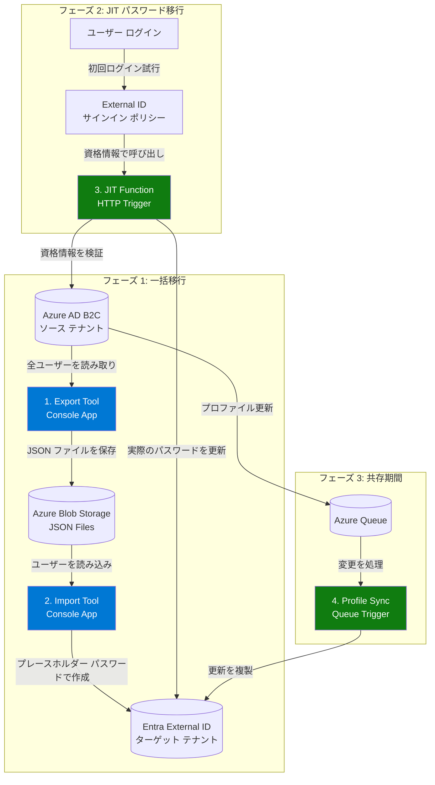

日本語 | **[English](README.md)**

# Azure AD B2C to Entra External ID Migration Kit

> **⚠️ プレビュー/サンプル ステータス**  
> これは [Just-In-Time パスワード移行パブリック プレビュー](https://learn.microsoft.com/entra/external-id/customers/how-to-migrate-passwords-just-in-time)を紹介する**サンプル実装**です。**本番環境向けではありません**。計画されている機能については[ロードマップ](#-今後のステップと将来の機能強化)をご覧ください。

Azure AD B2C から Microsoft Entra External ID へ、最小限のダウンタイムで、Just-In-Time (JIT) 認証によるシームレスなパスワード移行を実現するユーザー移行ツールキットです。

## 🎯 概要

この移行キットは、以下の機能を備えた ID 移行のサンプル ソリューションを提供します：

- ✅ **一括エクスポート/インポート** - リトライ ロジックとスロットリング管理を備えた効率的なバッチ処理
- ✅ **Just-In-Time (JIT) パスワード移行** - ユーザーの初回ログイン時にシームレスにパスワードを移行
- ✅ **完全な可観測性** - メトリクスとダッシュボードを備えた Application Insights 統合

## 🏗️ アーキテクチャ

**主要コンポーネント：**

1. **B2CMigrationKit.Console** - エクスポート/インポート操作用の CLI ツール
2. **B2CMigrationKit.Function** - JIT パスワード移行用の Azure Function
3. **B2CMigrationKit.Core** - 共有ビジネス ロジックとサービス

## 移行フロー

---

## 🔑 主な機能

### ✅ 現在利用可能な機能

- **一括ユーザー エクスポート** - 自動ページネーションによる Azure AD B2C からのエクスポート
- **一括ユーザー インポート** - 拡張属性を含む External ID へのインポート
- **JIT パスワード移行** - カスタム認証拡張機能経由での移行
- **UPN ドメイン変換** - [サインイン エイリアス](https://learn.microsoft.com/ja-jp/entra/external-id/customers/how-to-sign-in-alias)機能を有効にする回避策としてローカル部分識別子を保持
- **属性マッピング** - 柔軟なフィールド変換
- **エクスポート フィルタリング** - 表示名パターンとユーザー数制限によるフィルタリング
- **組み込みリトライ ロジック** - 指数バックオフ付き
- **包括的なテレメトリ** - Application Insights 統合
- **ローカル開発モード** - Azurite エミュレーターを使用（Azure リソース不要）
- **マルチ インスタンス スケーリング** - 大量移行向け
  
> **⚠️ プレビュー/サンプル ステータス**: このツールキットは現在、エクスポート、インポート、JIT 機能の [Just-In-Time パスワード移行パブリック プレビュー](https://learn.microsoft.com/ja-jp/entra/external-id/customers/how-to-migrate-passwords-just-in-time?tabs=graph)の実装方法を紹介する**サンプル実装**です。完全な SFI 準拠（プライベート エンドポイント、VNet 統合、自動インフラストラクチャ デプロイメント）を含む本番環境向け機能は、将来のリリースで計画されています。

## 📚 ドキュメント

この移行キットには、2 つの包括的なガイドが含まれています：

### [Architecture Guide](docs/ARCHITECTURE_GUIDE.md)
ソリューション アーキテクト、技術リード、セキュリティ レビュアー向けの完全なアーキテクチャ概要：
- エグゼクティブ サマリーとシステム設計
- コンポーネント アーキテクチャ（Export、Import、JIT、Profile Sync）
- セキュリティ アーキテクチャとコンプライアンス パターン
- スケーラビリティ、パフォーマンス ベンチマーク、マルチ インスタンス デプロイメント
- デプロイメント トポロジと運用上の考慮事項
- コスト最適化戦略

**対象読者：** ソリューション アーキテクト、技術リード、セキュリティ レビュアー

### [Developer Guide](docs/DEVELOPER_GUIDE.md)
移行を実装・運用する開発者向けの完全な技術リファレンス：
- プロジェクト構造と設定ガイド
- 開発ワークフローとローカル セットアップ
- RSA キーとカスタム認証拡張機能を使用した JIT（Just-In-Time）移行実装
- 属性マッピング設定と UPN 変換
- コンプライアンス追跡用のインポート監査ログ
- 大量移行（10 万ユーザー超）向けのスケーリング
- 運用、Application Insights によるモニタリング、トラブルシューティング
- セキュリティ ベスト プラクティスとデプロイメント手順

**対象読者：** 開発者、DevOps エンジニア、運用チーム

## 🚀 今後のステップと将来の機能強化

このリポジトリは現在、[Just-In-Time パスワード移行パブリック プレビュー](https://learn.microsoft.com/ja-jp/entra/external-id/customers/how-to-migrate-passwords-just-in-time?tabs=graph)の実装を例示することに焦点を当てています。将来の機能強化には以下が含まれます：

- **自動インフラストラクチャ デプロイメント**: 自動デプロイメント テンプレート（Bicep/Terraform）による Secure Future Initiative (SFI) 標準への準拠
- **本番環境向けセキュリティ**: プライベート エンドポイント、VNet 統合、マネージド ID との完全な統合
- **プロファイル同期**: 共存フェーズ中のキューベースの双方向同期

これらの機能は、完全なエンタープライズ グレードの移行ソリューションを提供するために、今後のリリースで計画されています。

## 📊 テレメトリ

このプロジェクトは、モニタリングと診断のためにテレメトリ データを収集するために Application Insights を使用しています。テレメトリ収集はオプションであり、設定で制御できます：

- **テレメトリを有効にする**には: `appsettings.json` で `Telemetry:Enabled` を `true` に設定し、Application Insights 接続文字列を指定します
- **テレメトリを無効にする**には: 設定で `Telemetry:Enabled` を `false` に設定します

ローカル開発では、テレメトリはデフォルトで無効になっています。詳細な設定オプションについては [Developer Guide](docs/DEVELOPER_GUIDE.md#telemetry-configuration) を参照してください。

**プライバシーに関する注意**: テレメトリが有効な場合、Microsoft はソフトウェアの使用に関する情報を収集する場合があります。収集されたデータは、ソフトウェアの品質と信頼性の向上に役立てられます。Microsoft のプライバシー慣行の詳細については、[Microsoft プライバシー ステートメント](https://privacy.microsoft.com/privacystatement)を参照してください。

## 🤝 コントリビューション

コントリビューションを歓迎します！以下の詳細については、[Contributing Guide](CONTRIBUTING.md) を参照してください：
- 開発環境のセットアップ方法
- コーディング標準とベスト プラクティス
- プル リクエストの送信
- イシューの報告

## 🔒 セキュリティ

セキュリティは最優先事項です。セキュリティの脆弱性を発見した場合は、責任ある開示のために [Security Policy](SECURITY.md) に従ってください。

## 💬 サポート

質問、イシュー、またはディスカッションについては、[Support Guide](SUPPORT.md) を参照してください。

## 行動規範

このプロジェクトは [Microsoft オープン ソース行動規範](https://opensource.microsoft.com/codeofconduct/)を採用しています。詳細については [行動規範に関する FAQ](https://opensource.microsoft.com/codeofconduct/faq/) を参照するか、追加の質問やコメントがある場合は [opencode@microsoft.com](mailto:opencode@microsoft.com) にお問い合わせください。

## 📄 ライセンス

このプロジェクトは MIT ライセンスの下でライセンスされています。詳細については [LICENSE](LICENSE) ファイルを参照してください。

## ™️ 商標

このプロジェクトには、プロジェクト、製品、またはサービスの商標またはロゴが含まれている場合があります。Microsoft の商標またはロゴの許可された使用は、[Microsoft の商標およびブランド ガイドライン](https://www.microsoft.com/legal/intellectualproperty/trademarks/usage/general)に従う必要があります。このプロジェクトの改変版で Microsoft の商標またはロゴを使用する場合、混乱を招いたり、Microsoft のスポンサーシップを暗示したりしてはなりません。サードパーティの商標またはロゴの使用は、それぞれのサードパーティのポリシーに従う必要があります。
